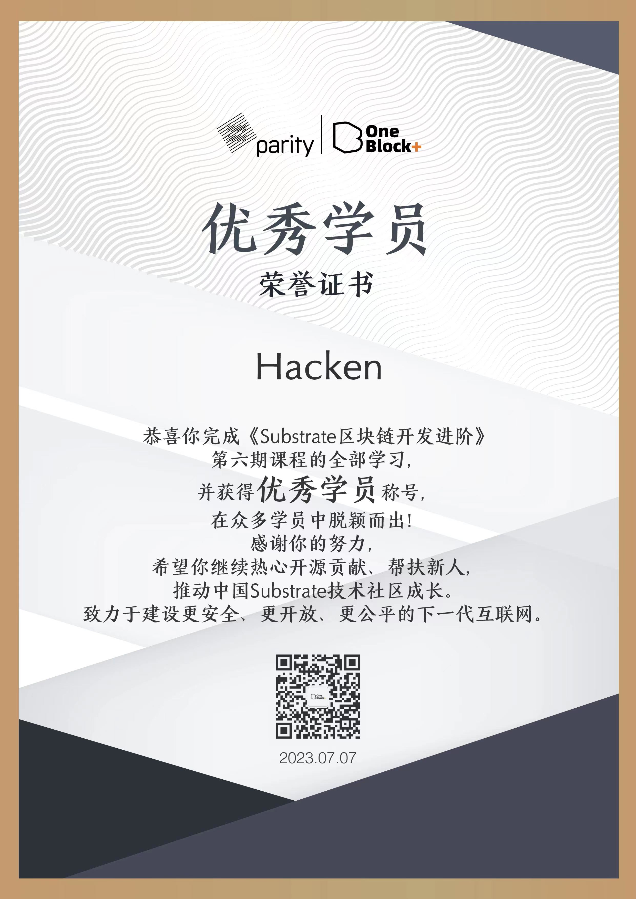

Title: Substrate 进阶课程
Date: 2023-07-18 00:16
Modified: 2023-07-18 00:16
Category: blockchain
Tags: blockchain, rust, substrate
Slug: substrate-advanced-course
Authors: Hacken
Summary: 完成了 Substrate 的一个进阶课程，简单的回顾和纪录一下。

### 为什么学习 Substrate 进阶课程

时隔 1 年，终于有机会继续学习 Substrate 了。我知道 Substrate 的时间已经不短了，也知道很多人围绕波卡生态在一直输出，很感兴趣。

一年前完成了初级课程，但是没有继续学习下去，主要是因为没有找到一个好的学习资源，更重要的是也没有一个好的学习目标。

当看到进阶课开始招募的时候，毫不犹豫的加入了，至少不要让初级课的学习沉没了吧，如果能对 Web3 或者区块链的开发有更深入的认识就更好了。

而这一年断断续续的学习 Rust，也在 Mike 的建议下加入到 EightFish 的开发中，算是混迹于波卡或者更宽泛的来讲 web3 的生态之中。

### 我的学习过程

Oneblock 把课程安排的比较好了，视频课程+助教准实时答疑+每周五的 Office Hour+课后作业， 基本上打造了一个完整的学习闭环。只需要傻傻的跟着学就可以了。
最终我以满分通过了所有的作业，当然我这个满分还是有点水分的，取决于助教的风格，不过我每次作业也还是比较认真的完成了。
基于这个成绩，我也得到了一个优秀学员的称号，哈哈，感谢 OneBlock+的鼓励。


### 我的完课总结

此时此刻我已经完成了这个进阶课程。

一下是我在 OneBlock+ 团队搜集反馈的时候做的总结陈述,基本上就是我对这个课程最新的评价和感受。

```
1.个人介绍

我是Hacken，在成都做了10年+的开发，很早就听说过Substrate，后面在朋友圈看到有Oneblock+的课程，就毫不犹豫的加入了。

2.为什么报名Substrate进阶课程

了解区块链开发可以有很多路径，我认为Substrate初级课程就是其中之一。
学完初级课其实感觉更多的是模仿和简单理解，进阶课程更深入更全面的的介绍如何用Substrate进行开发是我认为非常必要的。

3.对课程的总体评价

非常好的课程，除了内容的很好，我比较喜欢这个课程结构，
录播给了学习更多的自由度，答疑时间又补足了录播课缺乏互动的问题，Office Hour更是升级了交流互动的程度。

4.在课程中收获什么，课程还有哪些不足

课程最直接的收获还是知识性的，认识如何用substrate进行区块链相关的开发包括其上合约的开发。
当然也有很多通用的区块链知识。
不足的话我觉得初级课和高级课时间间隔太大了，substrate本身发展很快，造成知识脱节，不过新技术应该都有这个问题。
对学员学习结果的检验可以跟细致一些，比如做一些选择题，判断题作为编程题的辅助。

5.学习Substrate课程或者区块链开发有什么学习经验分享跟学弟学妹分享的
6.对学习Substrate课程的同学有什么建议

我是开发者，所以建议还是要对substrate社区和技术演进保持关注，花时间认真的去体验这个生态，
包括但不限于阅读项目代码，参与波卡质押，治理等，也可以去关注感兴趣的波卡生态项目，
看看他们是如何通过在substrate基础上开发出一个产品，去体验，去尝试，甚至去贡献代码。
```

如果你问我值不值得一学？

如果是年轻一点的我会说当然值得一学，学好了还能退学费，也能找工作， 为什么不？折腾万岁。
现在会更加审慎的给出建议，每个人都有自己的节奏与目标，不要人云亦云，如果自己觉得喜欢，价格不是问题，时间不是问题。

如果 OneBlock 会出一个超高级课程，我想我还是会参加。

### 展望

还是希望自己如总结里面提到的，多关注和参与生态的建设，做一个 builder，对回报的期望放低一些，多做一些事情。
